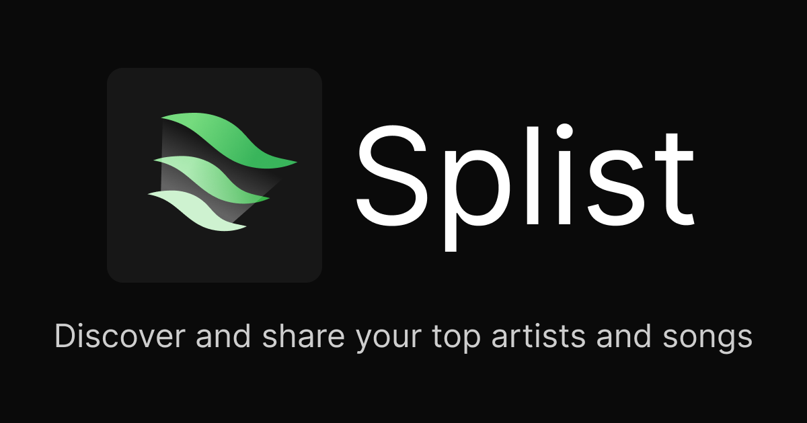

# splist

## Developer Setup

1. Go to spotify's developer dashboard and create an app for the web API - [https://developer.spotify.com/dashboard](https://developer.spotify.com/dashboard)
2. Make sure the redirect is just to `http://localhost:3000/api/auth/callback/spotify`
3. Take the `client_id` and `client_secret` from your app and put them in a `.env` file similar to [.env.template](./.env.template)
4. Start cooking 👩🏻‍🍳

## Figma

[https://www.figma.com/design/K8bt4A940oYXpTfiilwLqe/splist?node-id=0-1&t=vZohXVzQ5JeeB7l8-1](https://www.figma.com/design/K8bt4A940oYXpTfiilwLqe/splist?node-id=0-1&t=vZohXVzQ5JeeB7l8-1)

## TODO

- handle when topTracks or topArtists are empty (display - "not enough data")

## Notes

- image top tracks gets cut off if the width of contents ends up being to long for the overall width (solution is to just increase overall width)